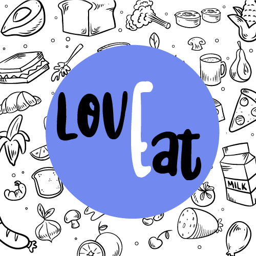

# LovEat | Red Social para los amantes de las recetas

## Índice

* [1. Preámbulo](#1-preámbulo)
* [2. Resumen del proyecto](#2-resumen-del-proyecto)
* [3. Prototipado](#3-prototipado)
* [4. Historias de usuario](#4-historias-de-usuario)

## 1. Preámbulo

Instagram, Snapchat, Twitter, Facebook, Twitch, Linkedin, etc. Las redes
sociales han invadido nuestras vidas. Las amamos u odiamos, y muchos no podemos
vivir sin ellas.

## 2. Resumen del proyecto

En este proyecto se contruyo una Red Social para los amantes de las recetas. LovEat permite iniciar sesion, si no se tiene una cuenta permite registrarse ya sea con email y contraseña o autenticandose con Google.

Al iniciar sesion o registrarse la red social lleva al usuario al 'Feed' donde se podra ver dos secciones; La primera seccion muestra el perfil del usuario que inicio sesion, su nombre y un formulario donde puede diligenciar los datos de una receta y el boton de publicar.

La segunda seccion es el listado de todas las publicaciones de las personas registradas y que publicaron una o mas recetas. A cada receta el usuario logueado puede dar 'Like' a la publicacion, en este cado cada publicacion muestra el total de likes obtenidos.

Para la persona que publica la receta, la red social le permite dar like a su propia receta, editar y/o eliminarla.

A continuacion damos un vistazo de LovEat:

## 3. Prototipado

Para el desarrollo de LovEat se realizo un prototipado de baja y alta fidelidad, de igual manera estos prototipos tuvieron su respectivo test de usabilidad.

### Prototipos de baja fidelidad

#### Pantalla inicial y pantalla feed

### Prototipos de alta fidelidad

#### Pantalla iniciar sesion 

#### Pantalla registro

#### Pantalla feed o wall

## 4. Historias de usuario

* _**Historia de usuario No.1**_: Yo Como usuaria
Quiero crear una cuenta con correo y contraseña
Para lograr ingresar a la red social

* _**Historia de usuario No.2**_: Yo como usuaria,
Quiero poder registrarme con Google,
Para acceder al muro de la red social.

* _**Historia de usuario No.2**_: Yo como usuaria,
Quiero poder ingresar al muro de publicaciones,
Para poder ver las publicaciones de otras personas.

